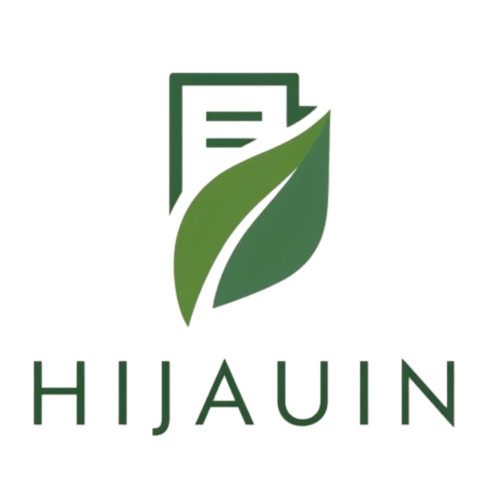

<div align="center">
  <a href="https://github.com/username/hijauin">
    
  </a>

  <h1 align="center">HijauIN 🌱</h1>

  <p align="center">
    <strong>Platform Kolaboratif untuk Lingkungan yang Lebih Bersih dan Transparan</strong>
  </p>

  <p align="center">
    <a href="https://laravel.com">
      
    </a>
    <a href="https://filamentphp.com">
      
    </a>
    <a href="https://tailwindcss.com">
      
    </a>
    <a href="https://mysql.com">
      
    </a>
  </p>
</div>

---

## 🌏 Mengapa HijauIN?

Bingung lapor ke mana saat melihat tumpukan sampah liar? Atau Anda melapor tapi tidak ada tindak lanjut?

**HijauIN** adalah solusinya. Aplikasi ini menjembatani Masyarakat dengan Pemerintah/Petugas. Kami mengubah keluhan menjadi data yang bisa ditindaklanjuti, dilacak, dan diselesaikan secara transparan.

## 🚀 Fitur Unggulan

### 📱 Untuk Warga (Pelapor)
* **Lapor Cepat:** Ambil foto, lokasi terdeteksi otomatis (GPS), dan kirim.
* **Real-time Tracking:** Pantau status laporan (Pending ➝ Disetujui ➝ Dikerjakan ➝ Selesai).
* **Bukti Nyata:** Lihat foto "Before & After" sebagai validasi masalah telah selesai.

### 🛡️ Untuk Admin & Petugas
* **Verifikasi Mudah:** Panel admin (Filament) untuk memilah laporan valid vs spam.
* **Manajemen Tim:** Penugasan petugas lapangan secara spesifik.
* **Analitik Data:** Statistik visual untuk memantau area rawan masalah lingkungan.

## 🛠️ Teknologi

Proyek ini menggunakan _tech stack_ modern:

* **Framework:** Laravel 11
* **Admin Panel:** FilamentPHP
* **Styling:** Tailwind CSS (Dark Mode ready)
* **Database:** MySQL

## 💻 Cara Menjalankan (Localhost)

Ikuti langkah berikut untuk menjalankan proyek di komputer Anda:

1. **Clone Repository**

   ```bash
   git clone [https://github.com/username/hijauin.git](https://github.com/username/hijauin.git)
   cd hijauin
   ```

3.  **Setup Environment**

    ```bash
    cp .env.example .env
    # Buka file .env dan sesuaikan konfigurasi database Anda
    ```

4.  **Install Dependencies**

    ```bash
    composer install
    npm install
    ```

5.  **Database & Seeding**

    ```bash
    php artisan migrate --seed
    # Perintah ini akan membuat akun Superadmin default
    ```

6.  **Jalankan Aplikasi**

    ```bash
    npm run dev
    # Buka terminal baru
    php artisan serve
    ```

## 👥 Tim Pengembang

Dipersembahkan oleh mahasiswa yang peduli lingkungan:

| Peran | Nama | Username |
| :--- | :--- | :--- |
| **DevOps** | Taufik | [@fiksDevvv](https://github.com/fiksDevvv) |
| **Backend** | Rifki Andriyan | [@RifkiAndriyanPratama](https://github.com/RifkiAndriyanPratama) |
| **Frontend** | Sin-cai | [@Sin-cai](https://github.com/Sin-cai) |


<div align="center">
  <p>
    Dibuat dengan ❤️ untuk Bumi yang lebih hijau.<br>
    &copy; 2025 Tim Si Imoet
  </p>
</div>
